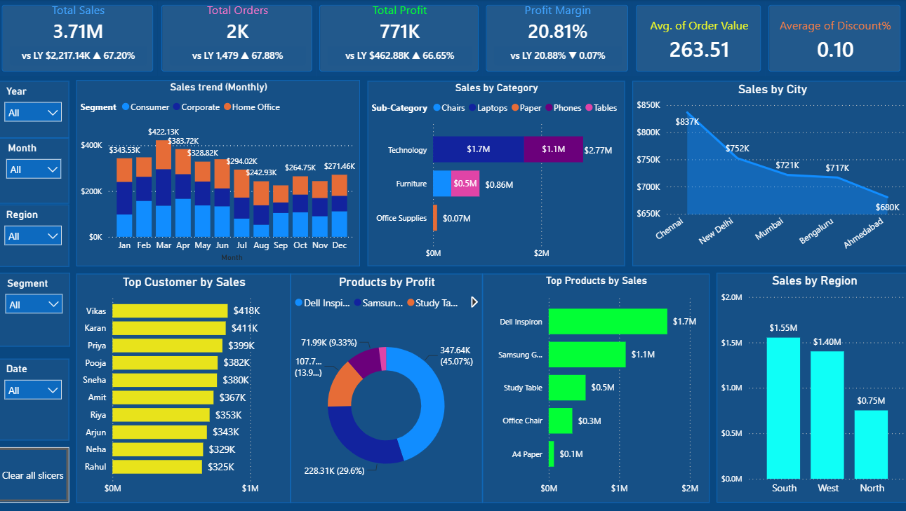

# 🧾 Retail Store Performance - Sales Analysis

_Analyze Retail Store sales performance , profitability and support to decision-making using Power BI ,Python , SQL._

---

## 📌 Table of Contents
- <a href="#overview">Overview</a>
- <a href="#business-problem">Business Problem</a>
- <a href="#dataset">Dataset</a>
- <a href="#tools--technologies">Tools & Technologies</a>
- <a href="#project-structure">Project Structure</a>

- <a href="#exploratory-data-analysis-eda">Exploratory Data Analysis (EDA)</a>
- <a href="#research-questions--key-findings">Research Questions & Key Findings</a>
- <a href="#dashboard">Dashboard</a>
- <a href="#how-to-run-this-project">How to Run This Project</a>
- <a href="#final-recommendations">Final Recommendations</a>
- <a href="#author--contact">Author & Contact</a>

---
<h2><a class="anchor" id="overview"></a>Overview</h2>

This project presents an interactive Retail Store Sales Dashboard developed in Power BI to analyze sales performance , profitability  and support to decision-making using Power BI , Python , SQL . 
---
<h2><a class="anchor" id="business-problem"></a>Business Problem</h2>

Retail Store has experienced inconsistent sales and declining profitability across different regions and product categories. Management cannot easily identify which products, customers, and regions are driving revenue and which are reducing profits. They need Analysis of sales, performance of last year, and support data-driven decisions to increase revenue and profitability.

---
<h2><a class="anchor" id="dataset"></a>Dataset</h2>

- CSV file located in `/data/` folder (retail store sales)

---

<h2><a class="anchor" id="tools--technologies"></a>Tools & Technologies</h2>

- SQL (Data Cleaning, Filtering, Sorting, Aggregation)
- Python (Pandas, Matplotlib, Seaborn)
- Power BI (Dashboard Development, Data Visualization)
- GitHub

---
<h2><a class="anchor" id="project-structure"></a>Project Structure</h2>

```
vendor-performance-analysis/
│
├── README.md
├── .gitignore
├── requirements.txt
├── Retail Store Sales Report.pdf
│
├── notebooks/                  # Jupyter notebooks
│   └── Retail Store Sales Notebook .ipynb
│
├── scripts/                    # Python scripts for ingestion and processing
│   └── Retail Store Sales db.py
│
├── dashboard/                  # Power BI dashboard file
│   └── Retail Store Sales Dashboard.pbix
```

---
<h2><a class="anchor" id="exploratory-data-analysis-eda"></a>Exploratory Data Analysis (EDA)</h2>

**Total Sales: Rs 37,07,112 | Total Profit: Rs 7,71,388 | Overall Margin: 20.81%**
- Technology dominates sales (Rs 27.7L), well ahead of Furniture (Rs 8.6L) and Office Supplies (Rs 0.75L)
- South is the top-selling region (Rs 15.5L), followed by West (Rs 14.0L) and North (Rs 7.5L)
- Consumer is the leading segment (Rs 13.8L), only slightly ahead of Home Office and Corporate - fairly balanced
- Discount is negatively correlated with Profit Margin (r = -0.65) - every markdown meaningfully erodes margin
- 43 orders (1.7%) were sold at a loss (negative profit)
- Return rate is ~50% and evenly spread across categories - unusually high for real retail data, worth validating with the data source; may be a data-generation artifact rather than genuine customer behavior
- Ship Mode doesn't track actual delivery speed here - Express, Same Day, and Standard all average ~4 days to ship, so this field may not be reliable for delivery-time analysis
- No missing values and no duplicate records were found - the dataset is clean and ready for further modeling

---
<h2><a class="anchor" id="research-questions--key-findings"></a>Research Questions & Key Findings</h2>

1. Increasing sales of Top performing Products - Run marketing campaigns for bast-selling items
2. Improve low-profit products - Reduce unnecessary discounts
3. Focus on high-performing regions - Increase inventory and marketing in high-performing regions
4. Send personalized product recommendations.
5. Improve underperforming categories
6. Optimize shipping
7. Prepare for seasonal demand - Increase inventory before peak seasons.
8. Hire temporary staff if needed.

---
<h2><a class="anchor" id="dashboard"></a>Dashboard</h2>

- Power BI Dashboard shows:
  - Sales trend
  - Top customers
  - Top products by sales
  - Products by Profit



---
<h2><a class="anchor" id="how-to-run-this-project"></a>How to Run This Project</h2>

1. Clone the repository:
```bash
[https://github.com/kleditsbat-art/retail-store-sales-performance-analysis-python-powerbi-sql/tree/main]
```
3. Load the CSVs and ingest into database:
```bash
[Retail Store Sales DB.sql
```
4. Open and run notebooks:
   - `Retail Store Sales Notebook.ipynb`
5. Open Power BI Dashboard:
   - `dashboard/Retail Store Sales Dashboard.pbix`

---
<h2><a class="anchor" id="final-recommendations"></a>Final Recommendations</h2>

•	Increasing sales of Top performing Products
•	Improve low-profit products
•	Improve underperforming regional performance

---
<h2><a class="anchor" id="author--contact"></a>Author & Contact</h2>

**Kartik Lokare**  
Data Analyst  
📧 Email: [kartiklokare8@gmali.com](kartiklokare8@gmali.com)
🔗 [LinkedIn](linkedin.com/in/kartik-lokare-5521a7395)  
